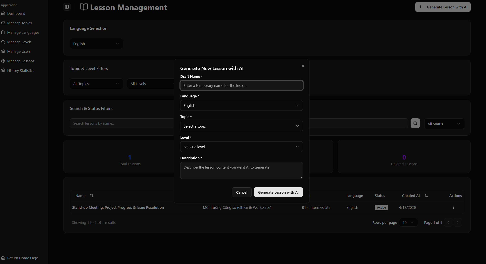
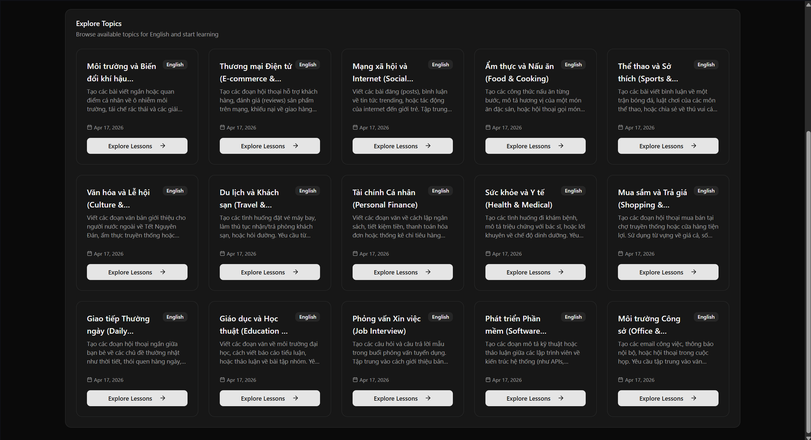
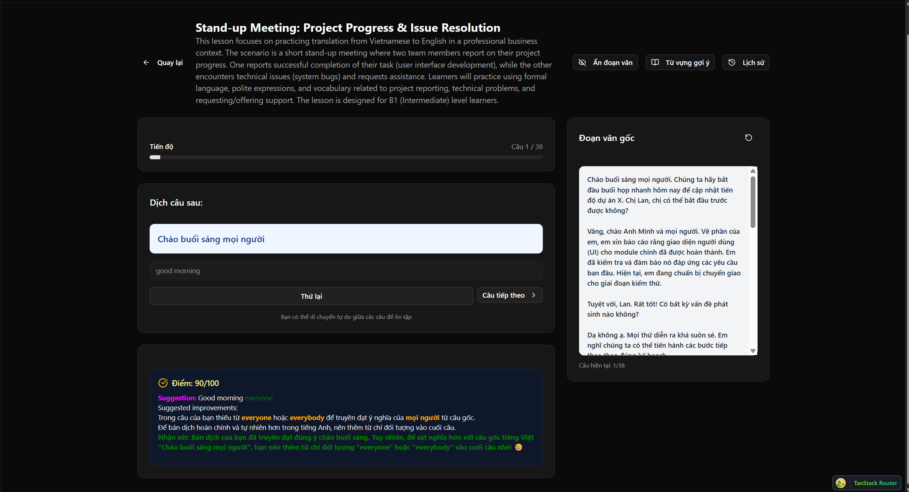
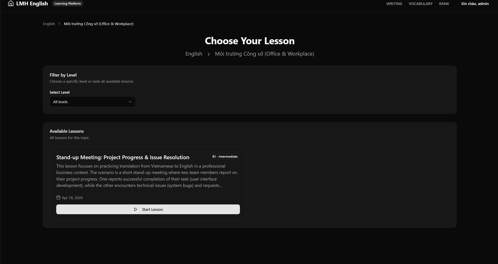
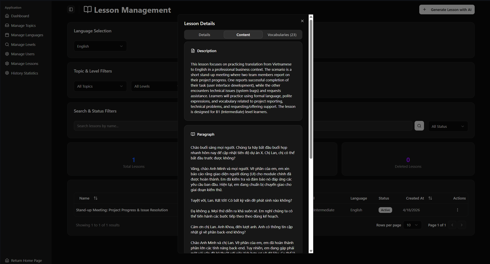
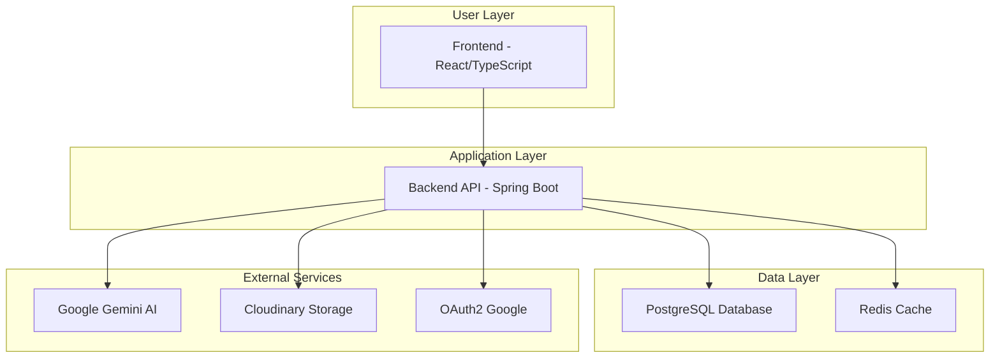

# 🌟 Translate Vietnamese to English Practice Web

[](https://www.oracle.com/java/)
[](https://spring.io/projects/spring-boot)
[](https://www.postgresql.org/)
[](https://reactjs.org/)
[](https://www.typescriptlang.org/)
[](https://www.docker.com/)

## Giới thiệu tổng quan

**Translate Vietnamese to English Practice Web** là một nền tảng web tiên tiến được thiết kế để hỗ trợ người học luyện tập kỹ năng dịch thuật từ tiếng Việt sang tiếng Anh một cách hiệu quả và cá nhân hóa. Dự án giải quyết bài toán phổ biến trong việc học ngoại ngữ: thiếu công cụ thực hành dịch thuật chất lượng cao với phản hồi tức thời từ trí tuệ nhân tạo.

Luồng nghiệp vụ cốt lõi bao gồm: Người dùng lựa chọn bài học (lesson) theo chủ đề và cấp độ, thực hiện dịch đoạn văn, sau đó gửi cho hệ thống AI để chấm điểm và nhận phản hồi chi tiết, đồng thời lưu trữ lịch sử luyện tập để theo dõi tiến bộ.

## Tính năng nổi bật

### Tạo và quản lý bài học (Lesson Management)



- **Tạo bài học tùy chỉnh**: Người dùng có thể tự tạo bài học với đoạn văn tiếng Việt, mô tả và chủ đề.
- **Phân loại theo cấp độ**: Hỗ trợ nhiều cấp độ từ cơ bản đến nâng cao.
- **Tổ chức theo chủ đề**: Bài học được nhóm theo các chủ đề như kinh doanh, công nghệ, văn hóa, v.v.
  

### AI Chấm điểm thông minh (Intelligent AI Grading)



- **Tích hợp Google Gemini**: Sử dụng mô hình AI tiên tiến để đánh giá chất lượng bản dịch.
- **Tiêu chí đánh giá toàn diện**: Độ chính xác về nghĩa (40%), ngữ pháp (30%), từ vựng (20%), tính tự nhiên (10%).
- **Phản hồi chi tiết**: Cung cấp điểm số, nhận xét, gợi ý cải thiện và phiên bản dịch chuẩn.

### Theo dõi tiến độ (Progress Tracking)



- **Lịch sử luyện tập**: Lưu trữ toàn bộ phiên dịch và phản hồi AI.
- **Thống kê cá nhân**: Theo dõi điểm số trung bình, số bài đã hoàn thành.
- **Hệ thống điểm thưởng**: Tích lũy điểm để mở khóa tính năng nâng cao.

### Bảo mật và xác thực (Security & Authentication)



- **OAuth2 Google Login**: Đăng nhập an toàn qua tài khoản Google.
- **JWT Token**: Bảo vệ API với JSON Web Tokens.
- **Phân quyền**: Hỗ trợ vai trò người dùng và quản trị viên.

## Công nghệ sử dụng

### Backend

- **Framework**: Spring Boot 3.5.3
- **Ngôn ngữ**: Java 17
- **Database**: PostgreSQL 42.7.3 với Liquibase cho quản lý schema
- **Cache**: Redis cho tối ưu hiệu suất
- **Authentication**: JWT, OAuth2 Google
- **File Storage**: Cloudinary cho lưu trữ hình ảnh
- **Mapping**: MapStruct cho object mapping
- **Validation**: Jakarta Validation API

### Frontend

- **Framework**: React 19.1.0 với TypeScript
- **Build Tool**: Vite
- **Styling**: Tailwind CSS với Radix UI components
- **State Management**: TanStack Query cho API state
- **Routing**: TanStack Router
- **Form Handling**: React Hook Form với Zod validation
- **Icons**: Lucide React và Tabler Icons

### Database

- **Primary DB**: PostgreSQL
- **Migration**: Liquibase
- **ORM**: Hibernate JPA

### DevOps/Deployment

- **Containerization**: Docker và Docker Compose
- **Email**: SMTP Gmail cho thông báo
- **Monitoring**: Spring Boot Actuator (implied)

## Kiến trúc hệ thống

Dự án được thiết kế theo kiến trúc **monolithic** với sự tách biệt rõ ràng giữa backend và frontend, sử dụng containerization để đảm bảo tính nhất quán giữa các môi trường.



### Giải thích kiến trúc:

- **Frontend Layer**: Xử lý giao diện người dùng, routing và state management.
- **Application Layer**: Chứa business logic, API endpoints, authentication và integration với AI.
- **Data Layer**: Quản lý dữ liệu persistent và caching.
- **External Services**: Tích hợp với AI, storage và authentication providers.

## Cơ sở dữ liệu

### Thực thể chính (Core Entities)

| Thực thể             | Mô tả                           | Quan hệ chính                        |
| -------------------- | ------------------------------- | ------------------------------------ |
| `users`              | Thông tin người dùng            | 1:N với lesson, history              |
| `lesson`             | Bài học với đoạn văn tiếng Việt | N:1 với topic, user, language, level |
| `topic`              | Chủ đề bài học                  | 1:N với lesson                       |
| `language`           | Ngôn ngữ hỗ trợ                 | 1:N với lesson, level                |
| `level`              | Cấp độ khó                      | 1:N với lesson                       |
| `history`            | Lịch sử dịch và chấm điểm AI    | N:1 với user, lesson                 |
| `suggest_vocabulary` | Từ vựng gợi ý cho bài học       | N:1 với lesson                       |

### Đặc điểm thiết kế:

- **Audit Trail**: Các bảng chính có `created_at`, `updated_at` để theo dõi thay đổi.
- **Soft Delete**: Sử dụng `delete_flag` thay vì xóa cứng để bảo toàn dữ liệu lịch sử.
- **Normalization**: Thiết kế chuẩn hóa để tránh redundancy, đảm bảo tính toàn vẹn dữ liệu.
- **Indexing**: Các foreign key và trường tìm kiếm được index để tối ưu performance.

## Tài liệu API

Dự án sử dụng RESTful API với chuẩn JSON response. Dưới đây là các endpoint quan trọng:

### Lesson APIs

| Method | Endpoint                                | Mô tả                                 |
| ------ | --------------------------------------- | ------------------------------------- |
| `GET`  | `/user/lessons`                         | Lấy danh sách bài học (có phân trang) |
| `GET`  | `/user/lessons/{lessonId}`              | Lấy chi tiết bài học                  |
| `GET`  | `/user/lessons/my-creations`            | Lấy bài học do người dùng tạo         |
| `POST` | `/user/lesson/{username}/add-lesson`    | Tạo bài học mới                       |
| `PUT`  | `/user/lesson/{username}/update-lesson` | Cập nhật bài học                      |

### AI Grading APIs

| Method | Endpoint                                 | Mô tả                        |
| ------ | ---------------------------------------- | ---------------------------- |
| `POST` | `/user/gemini/ask/{username}/{lessonId}` | Gửi bản dịch để AI chấm điểm |

### Request/Response Examples

**Tạo bài học:**

```json
POST /user/lesson/{username}/add-lesson
{
  "name": "Bài học về công nghệ",
  "description": "Luyện tập từ vựng công nghệ",
  "paragraph": "Công nghệ thông tin đang phát triển nhanh chóng...",
  "topicName": "Công nghệ",
  "languageRequest": {"name": "English"},
  "levelRequest": {"name": "Intermediate"}
}
```

**AI Chấm điểm:**

```json
POST /user/gemini/ask/{username}/{lessonId}
{
  "question": "Công nghệ thông tin đang phát triển nhanh chóng...",
  "answer": "Information technology is developing rapidly..."
}
```

**Response từ AI:**

```json
{
  "score": 95,
  "status": "good",
  "message": "Bản dịch rất tốt, chỉ cần điều chỉnh nhỏ về từ vựng",
  "rich_html": "<div class=\"feedback\">...</div>",
  "improvement_suggestions": [...]
}
```
